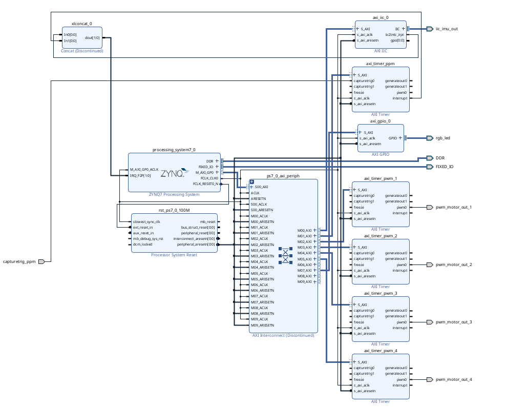

# Xilinx Zynq-7000 Flight Controller 

This is a custom flight controller for a quadcopter drone, implemented on a Zynq-7000 SoC on the [Zybo Z7-10 FPGA SoC Development Board](https://digilent.com/shop/zybo-z7-zynq-7000-arm-fpga-soc-development-board/?gad_source=1&gclid=Cj0KCQiAkeSsBhDUARIsAK3tiedDBNo96Tg5VWCeuEqzXgPKJSFg8GQ0qwLCV-v5TlTKltLerrQGLDkaAjBgEALw_wcB). The flight controller uses PID controllers along with a [MPU-6050 | 3 Axis Accelerometer Gyroscope ](https://www.amazon.com/HiLetgo-MPU-6050-Accelerometer-Gyroscope-Converter/dp/B01DK83ZYQ?th=1) for flight stability. Two flight modes are available: Rate Mode (Acro Mode) which uses a single loop PID controller and Stabilize Mode (Self-Leveling Mode) which uses a dual loop PID controller.

## Dependencies

### Hardware

* [Zybo Z7-10 FPGA SoC Development Board](https://digilent.com/shop/zybo-z7-zynq-7000-arm-fpga-soc-development-board/?gad_source=1&gclid=Cj0KCQiAkeSsBhDUARIsAK3tiedDBNo96Tg5VWCeuEqzXgPKJSFg8GQ0qwLCV-v5TlTKltLerrQGLDkaAjBgEALw_wcB)
* [MPU-6050 | 3 Axis Accelerometer Gyroscope ](https://www.amazon.com/HiLetgo-MPU-6050-Accelerometer-Gyroscope-Converter/dp/B01DK83ZYQ?th=1)
* [Radiolink T8FB 8 Channels 2.4GHz RC Remote Transmitter and R8EF Receiver](https://www.amazon.com/Radiolink-Transmitter-Receiver-2-4GHz-Controller/dp/B07DPK9Q9X/ref=sr_1_8?crid=34H23UYBP2SKA&dib=eyJ2IjoiMSJ9.DPB_D_-uXEtxyzGycjiEyngkkrfimBVfbW4ewKRMgHdWoZd8kxR5b7jw0f5nMZls2Qb6V5CaN3ZfWsz7HZxhJrX90tzAb0QPEJUbYPUGGb2kpEbRmFlTLI2P86QUEIuNXMQfID7UFSSD-5kdgcvyu__B-VTDg-fb5czwKHN0Wl5XwdQDziz_BhiWEbAXvPp5PIw9FovmLC-oN_uPQwk0yAiQCDHy_djiuKr69YO0ViHIPJ16aY1Z_osZuZJMaIu-6asyX8v1I-ymjkhxUaAazSm7HCGohjngMDOZZgtEtbo.cCZTWbZ4u9XV9URevBCROmEVp4g-vu0lXmYiJxgRPmQ&dib_tag=se&keywords=drone+transmitter+radiolink&qid=1708402155&sprefix=drone+transmitter+radiolink%2Caps%2C165&sr=8-8)
* [F450 Drone Frame](https://www.amazon.com/HAWKS-WORK-Quadcopter-Soldered-version/dp/B09YQ4G4ZZ/ref=sr_1_1_sspa?crid=3N3WTXPM9LDKL&dib=eyJ2IjoiMSJ9.4SM5ot4VWDgjLdCVw62C2yKGLYTUUuc3lbi4BrTFGE9lpAKh0yMmMXJ_HIy-w1ENHsgIOVhhmYWpFB1ATbVhs8RRjUUaeWzyVOR1N0ha3JY5y-i-1TJu3e379htrydVJESWKMowWwq3ruebfXOp-SGRewwEUEbb5dCo8WSYisElMiAdD_meuExWMUxu_mJaVYU8nyTCTg59dAqnkI0jdbjbaDX142WhmPunSSgKYpJLF43dOjwTOQLx0ovp_XpcfKXJkWCgRW7E7xXokXZvfmimUiE6o6ibQ7mAoeM-98c8.ubOFJzHZ3AU_jyVGw8lJqdBcv9VBNKbAPPYqhvaB-e4&dib_tag=se&keywords=f450%2Bdrone%2Bframe&qid=1708402234&sprefix=f450%2Bdrone%2Caps%2C195&sr=8-1-spons&sp_csd=d2lkZ2V0TmFtZT1zcF9hdGY&th=1)
* [30A RC Brushless Motor Electric Speed Controller](https://www.amazon.com/RC-Brushless-Electric-Controller-bullet/dp/B071GRSFBD/ref=sr_1_4?crid=JMXOMHTAUCHV&dib=eyJ2IjoiMSJ9.wcXRcC8u6WMTk321CJMspA4Bjo8WyvU7S9tdHj4XXrRZN6O7hHFl5kzbjSvzMTZ-En1jRhSm3J4cd7zgXAknn8JgPXHhCurCiWyFo9wgS5pcgzPpAIhjxL9Zowfe-L6ReOSvZWRXDYMergQ2oleuHK2eYooR3kCsa7zb9R_QjHrUg5n7qfPdMynH9s7QN47VYThoIomzGBI9prRIGsj_hF-og1T7GlsKNxmGigtNDy_M2_I7ierAaly00huwBsoYgW8GAUCkMK90ynJmFmaWF3O137GK70m53xuhO36fMbs.yiFtRNF5yDGhqlkxH_yx9H00WZNZ_0crOrciYLcckoY&dib_tag=se&keywords=30A%2BRC%2BBrushless%2BMotor%2BElectric%2BSpeed%2BController%2BESC%2B3A%2BUBEC%2Bwith%2BXT60%2B%26%2B3.5mm%2BBullet%2BPlugs&qid=1708402480&sprefix=30a%2Brc%2Bbrushless%2Bmotor%2Belectric%2Bspeed%2Bcontroller%2Besc%2B3a%2Bubec%2Bwith%2Bxt60%2B%26%2B3.5mm%2Bbullet%2Bplugs%2Caps%2C155&sr=8-4&th=1)
* [A2212 1000KV Brushless Motor](https://www.amazon.com/QWinOut-Brushless-Outrunner-Multi-Copter-Quadcopter/dp/B07CVDHQKS/ref=sr_1_1?crid=1G5IM8DKU8SIP&dib=eyJ2IjoiMSJ9._27XAJ6z8Xiract4kND7udNpiqoN_pQC9MedRzfhIFYGyRx9oyV5UhlLUdA22XvwF8kf8OSVQj0Fo-E9RT67TuAs-i4kOSFeHEzr5NU0mvVaUnKGs5Vf8deE6-NLwU4lUR9LpMEcDlGJF7BHMjlHVvMGppm1qU6BHaiMaZuR91UzML-gfybXsLUigy1LmJ-3tyF6_1ikHYOK8w0fWH6f9ZbS-gAenApGc8AXPPVziHve8GzoEiNgXvsa65UJDh4SNVLwRSYLvnt5_zQseZ6h8uqAZkQQI8VzSBp9jZAkarI.3QyAjjS6RmnuF1MkatmTFHBwq5IZlhVe7zZr4WBPnxk&dib_tag=se&keywords=QWinOut%2BA2212%2B1000KV%2BBrushless%2BOutrunner%2BMotor%2B13T%2Bwith%2B3.5mm%2BMale%2BBanana%2BBullet%2Bfor%2BRC%2BDIY%2BAircraft%2BMulti-Copter%2BQuadcopter%2BDrone%2B(1%2BPcs)&qid=1708402578&sprefix=qwinout%2Ba2212%2B1000kv%2Bbrushless%2Boutrunner%2Bmotor%2B13t%2Bwith%2B3.5mm%2Bmale%2Bbanana%2Bbullet%2Bfor%2Brc%2Bdiy%2Baircraft%2Bmulti-copter%2Bquadcopter%2Bdrone%2B1%2Bpcs%2B%2Caps%2C229&sr=8-1&th=1)

### Software

* [Xilinx Vivado](https://www.xilinx.com/products/design-tools/vivado.html)
* [Xilinx Vitis](https://www.xilinx.com/products/design-tools/vitis.html)

## Demo Video

* [Youtube Video Demo: Flight Test](https://youtu.be/FbfccM_4fSk?si=GJgJV7dLbOb1_a_V)
* [Youtube Video Demo: Mini Flight Test and KiCAD PCB Test](https://youtu.be/7qQ3-POSWRU)
* [Youtube Video Demo: PID Controller Test](https://youtu.be/jsMdaXCYHB4)

## Images

Block Design

Additional sensors (barometer, GPS, magnetometer, camera, etc.) are being integrated to enable features such as altitude hold, position hold, and object avoidance/detection.

